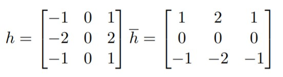

= Konvoluce 1 - Detekce hran

== Zadání
Vytvořte plugin do GIMPu realizující základní konvoluce pro detekci hran (Roberts, Prewitt, Sobel, Robin, Kirsch). Úkolem je realizovat plugin který pro celou aktuální vrstvu provede detekci hran konvolucí pomocí základních maticových operátorů.

== Ukázky fungování pluginu

Plugin se pustí nad vybraným obrázkem, pro ilustraci zde máme obrázek lotusu.

=== Original
image::imgs/lotus_original.jpg[Original Lotus Image, 300]

Po použití pluginu a vybrání operátoru získáváme černobílý obrázek. Bilá barva značí hranu v obrázku. Čím bělejší, tím silnější hrana.

=== Prewitt

=== Sobel

=== Robinson

=== Kirsch

== Princip fungování pluginu
Plugin funguje na principu Diskrétní Konvoluce (rastrové obrázky).

Zpracovávaný obrázek se projíždí pixel po pixelu a provádí se maticové násobení na matici sousedů zrovna zpracovávaného pixelu. Této matici se říká *konvoluční maska*.

Pro ilustraci si uvedeme Sobelův operátor (jádro):

Operátor *h* porovnává pixely nalevo a napravo od aktuálně zpracovávaného pixelu. Hodí se pro detekci vertikálních hran. Při detekci horizontálních hran je třeba matici transponovat. Takovou matici nám udává operátor *h transponovaný*.

Předchozí vztah nám udává konečnou váhu pixelu ve smyslu, jak rozdílné jsou okolní pixely momentálně zpracovávaného pixelu.

== Jak plugin používat
Plugin je napsaný na program GIMP verze 2.10.28 a na operační systém Windows. Instaluje a používá se následovně:

. Stáhneme a nainstalujeme GIMP 2.10.28
. Stáhneme link:res1.zip[plugin na detekci hran]
. Plugin umístíme do složky na pluginy v GIMPu
.. Cestu do složky pro pluginy je možno najít přímo v GIMPu v sekci +
  `Edit > Preferences > Folders > Plug-ins` a zkopírováním cesty na prvním řádku
. Vložíme fotku, na které chceme provést detekci hran do GIMPu
.. Fotka musí být vybraná a v aktivní vrstvě
. Plugin spustíme přes sekci `Filters > Edge Detection (moyalmic)`
. Vybereme požadovaný operátor pro detekci hran a stiskneme OK
. Do nové vrstvy se nad původní vrstvu vytvoří černobílá verze obrázku s detekovanými hranami

== Programová dokumentace

Hlavní funkce pluginu je samozřejmě funkce `convolution_plugin_main`. Tato funkce zapouzdřuje veškerou funkcionalitu pluginu.

[source,python]
----
    def convolution_plugin_main(self, run_mode, image, drawable):
        self.image = image
        self.drawable = drawable
        self.shelfkey = "edge_detect_moyal"
        # Create UI to ask the user which type of edge detection to do
        self.create_dialog()
        # Storage
        if not shelf.has_key(self.shelfkey):
            self.create_storage()

        pdb.gimp_image_undo_group_start(self.image)
        # If ran non interactively, 0 will be the default
        if run_mode == RUN_INTERACTIVE:
            self.dialog.run()
        else:
            self.operator = shelf[self.shelfkey]["kernel"]

        pdb.gimp_image_undo_group_end(self.image)
        gimp.displays_flush()
----

Další důležitou funkcí pro běh pluginu je funkce `process_image`, kde se odehrává samotné zpracování obrázku a zapisování dat do nové vrstvy

[source,python]
----
    def process_image(self):
        self.bpp = self.drawable.bpp
        tl_X, tl_Y, br_X, br_Y = self.drawable.mask_bounds
        self.width = abs(tl_X - br_X)
        self.height = abs(tl_Y - br_Y)

        source_region = self.drawable.get_pixel_rgn(tl_X, tl_Y, self.width,
        self.height, False, False)
        self.source_pixels = array.array("B", source_region[tl_X:br_X, tl_Y:br_Y])

        newLayer = gimp.Layer(self.image, "Edge Detect", self.width, self.height,
        RGB_IMAGE, 100, NORMAL_MODE)

        destination_region = newLayer.get_pixel_rgn(0, 0, self.width, self.height,
        True, True)
        self.destination_pixels = array.array("B", destination_region[0:self.width,
        0:self.height])

        self.image.add_layer(newLayer, 0)
        gimp.progress_init('Detecting edges...')
        for row in range(0, self.height):
            for col in range(0, self.width):
                # moves me row lines down, col indexes and also need to multiply
                # bits per pixel
                current_pixel = (row * self.width + col) * self.bpp
                pixel_data = self.source_pixels[current_pixel:current_pixel +
                self.bpp]
                neighbour_matrix = self.get_neighbour_matrix(col, row)
                pixel_edge_magnitude_x =
                self.get_pixel_edge_magnitude(neighbour_matrix, self.kernelX) * 0.5
                pixel_edge_magnitude_y =
                self.get_pixel_edge_magnitude(neighbour_matrix, self.kernelY) * 0.5
                pixel_edge_magnitude = math.sqrt(
                pow(pixel_edge_magnitude_x, 2) + pow(pixel_edge_magnitude_y, 2))
                pixel_edge_magnitude = min(pixel_edge_magnitude, 255)
                pixel_edge_magnitude = max(pixel_edge_magnitude, 0)
                for i in range(0, self.bpp):
                    pixel_edge_magnitude = min(pixel_edge_magnitude, 255)
                    pixel_edge_magnitude = max(pixel_edge_magnitude, 0)
                    pixel_data[i] = int(pixel_edge_magnitude)
                self.destination_pixels[current_pixel:current_pixel + self.bpp] =
                pixel_data
            gimp.progress_update(float(row + 1) / self.height)
        destination_region[0:self.width, 0:self.height] =
        self.destination_pixels.tostring()
        newLayer.flush()
        newLayer.merge_shadow(True)
        newLayer.update(0, 0, self.width, self.height)
----

Funkce obstarávající GUI pro výběr používaného operátoru se nazývá `create_dialog` a vypadá následovně

[source,python]
----
    def create_dialog(self):
        self.dialog = gimpui.Dialog("Edge Detect", "edge_detect_dialog")

        # create table
        self.table = gtk.Table(3, 6, False)
        self.table.set_row_spacings(10)
        self.table.set_col_spacings(10)
        self.table.show()

        # initialize container that holds everything together
        self.dialog.vbox.hbox = gtk.HBox(True, 0)
        self.dialog.vbox.hbox.show()
        self.dialog.vbox.pack_start(self.dialog.vbox.hbox, False, False, 0)
        self.dialog.vbox.hbox.pack_start(self.table, True, True, 0)

        # add sentence to guide a user
        self.label = gtk.Label("Choose operator for edge detection:")
        self.label.set_line_wrap(True)
        self.label.set_alignment(0, 0.5)
        self.label.show()
        self.table.attach(self.label, 1, 2, 0, 1)

        # create a list of items to choose from
        self.multi_choice = gtk.combo_box_new_text()
        self.multi_choice.append_text("Prewitt")
        self.multi_choice.append_text("Sobel")
        self.multi_choice.append_text("Robinson")
        self.multi_choice.append_text("Kirsch")

        # respond to user's choice
        self.multi_choice.connect("changed", self.change_kernel)
        self.multi_choice.set_entry_text_column(0)
        self.multi_choice.set_active(0)
        self.multi_choice.show()
        self.table.attach(self.multi_choice, 1, 2, 2, 3)

        # create ok and cancel buttons
        self.ok_button = self.dialog.add_button(gtk.STOCK_OK, gtk.RESPONSE_OK)
        self.cancel_button = self.dialog.add_button(gtk.STOCK_CANCEL,
        gtk.RESPONSE_CANCEL)

        self.ok_button.connect("clicked", self.ok_clicked)
        self.cancel_button.connect("clicked", self.cancel_clicked)

        # show dialog
        self.dialog.show()
----

Poslední funkce, kterou bych chtěl zmínit, je funkce `get_neighbour_matrix`. Ta nám vrátí matici hodnot sousedních políček. Pro pixely na kraji je vhodné reagovat přístupem *mirror extension*, ale to jsem kvůli nemožnosti použít externí knihovny pro manipulaci s daty nebyl schopný naimplementovat. Má implementace tedy používá přístup *zero padding*, která v některých případech způsobuje bílý okraj na okraji obrázku.

[source,python]
----
    def get_neighbour_matrix(self, col, row):
        neighbour_matrix = list()
        for offset in corners:
            nrow = row + offset[0]
            ncol = col + offset[1]
            position = 0
            # pixel is in bounds of image
            if nrow >= 0 and nrow < self.height and ncol >= 0 and ncol < self.width:
                position = (nrow * self.width + ncol) * self.bpp
                pixel_to_insert =
                greyscale_pixel(self.source_pixels[position:position + self.bpp])
                neighbour_matrix.append(pixel_to_insert)
            # This happens when the pixel is beyond the bounds of the image
            else:
                neighbour_matrix.append(0)
        return [neighbour_matrix[0:3], neighbour_matrix[3:6], neighbour_matrix[6:9]]
----

== Odkaz na stažení
Plugin lze stáhnout link:res1.zip[zde].

== Odkazy a reference
* Obrázky popisující konvoluci a práce s jádry čerpány z: +
https://courses.fit.cvut.cz/BI-PGA/media/lectures/20PGA_P3.pdf +
Slajd 77 a 86

* Obrázky používané u konvoluce čerpány z: +
https://encrypted-tbn0.gstatic.com/images?q=tbn:ANd9GcRhu7T_TSNJSxWdM5aNaekEunO3v1CYGSmlxg&usqp=CAU +
https://upload.wikimedia.org/wikipedia/commons/e/ed/Sacred_lotus_Nelumbo_nucifera.jpg

* Rozložení a osnova dokumentu přebrána z: +
https://gitlab.fit.cvut.cz/BI-PGA/b191/cimmrjar

* Inspirace funkce pro vytvoření dialogového okna přejata z: +
https://gitlab.fit.cvut.cz/BI-PGA/b201/mikulda3