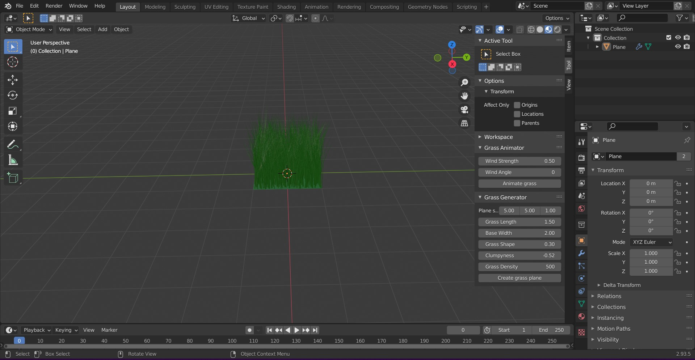
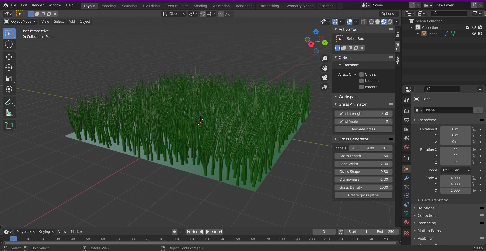
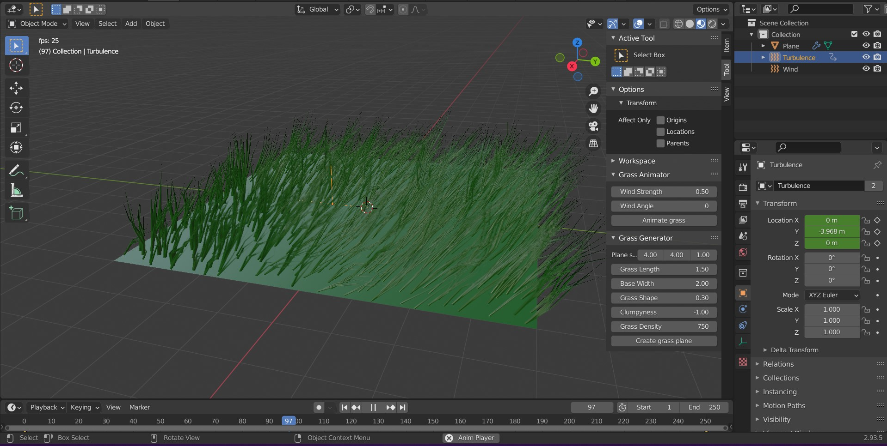
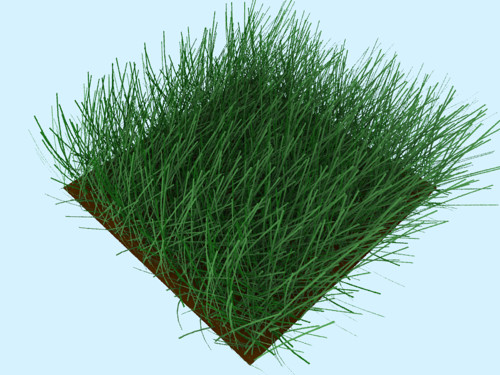

= Animace Trávy

== Zadání
Vytvořte plug-in do Blenderu, který umožní rozanimovat vhodný model trávy. Animace bude sestávat ze sekvence pohybů trávy ve větru. Ideálně upravitelného podle směru/síly větru.

Plugin by měl ideálně být schopný zpracovat více druh objektů (například rozdělit si objekt na primitiva, na mřížku a v každé mřížce aplikovat lehce jiný pohyb, atp.)

== Ukázky fungování pluginu

video::imgs/animation_example.mp4[]

Plugin umožňuje jak animaci, tak vytváření travnaté plochy podle paramatrů zadaných uživatelem v panelu Generátoru na pravé straně 3D View okna. Program obsahuje bug, který je podle mého na straně blenderu.

=== Základní plocha

Po nastavení požadovaných hodnot jako je například velikost plochy, tvar a délka trávy a jiné vypadá naše pracoviště takto:

=== Upravená travnatá plocha

Následně můžeme nastavit parametry animace v panelu Animátoru a po kliknutí tlačítka *Animate Grass* se nám spustí animace chvění trávy ve větru.

== Princip fungování pluginu
Plugin využívá vnitřní struktury blenderu, které jsou určeny pro vytváření a animaci vlasů. S dostatečnými úpravami lze ale dosáhnout efektu trávy chvějící se vě větru.

Používá primitivní plochu a takzvaný *Particle System* aplikovaný na tuto plochu. Existuje i možnost nahradit stébla trávy (vlasy) za jiný vhodný model, toto jsem ale neimplementoval.

== Jak plugin používat
Plugin je napsaný na program Blender verze aspoň 2.93 a na operační systém Windows. Instaluje a používá se následovně:

. Stáhneme a nainstalujeme Blender 2.93 nebo novější.
. Stáhneme link:res2.zip[plugin].
. V Blenderu si otevřeme `Edit > Preferences > Add-ons`.
. Vpravo nahoře klikneme na tlačítko `Install` a zvolíme stáhnutý `.py` soubor z kroku 2.
. Zaškrtneme políčko u pluginu se jménem *Animation: Grass Sway*, toto zaregistruje do blenderu náš plugin.
. V pravém toolbaru uvnitř 3D Scény se pod `Tools` objeví dva nové panely, *Grass Animator* a *Grass Generator*.

== Programová dokumentace

Hlavní funkce pluginu je funkce `convolution_plugin_main` třídy `Grass Animator`. Tato funkce se stará o vytváření efektu animace voláním podpůrných funkcí také definovaných v rámci třídy.

[source,python]
----
    def execute(self, context):
        self.grass_plane = context.active_object
        self.generate_wind(context, self.grass_plane)
        self.animate_keyframes(context)
        bpy.ops.screen.animation_play()
        return {'FINISHED'}
----

Nejdůležitější z těchto podpůrných funkcí je funkce `generate_wind`. Ta nám do scény přidá efektory vytvářející vítr a turbulence, aby tráva nabývala dojmu že se při spuštění animace hýbe vě větru. Turbulence přidává jakousi simulaci náhody, aby se každé stéblo trávy nehýbalo identicky.

[source,python]
----
    def generate_wind(self, context, active_obj):
        wind_properties = context.scene.wind_properties
        bpy.ops.object.effector_add(type='WIND',
        radius=wind_properties.wind_strength, align='CURSOR',
        rotation=(-90.0, 0.0, wind_properties.angle))
        context.scene.wind_object = bpy.context.active_object
        turbulence_location = (active_obj.location.x,
        active_obj.location.y-active_obj.scale.y,
        active_obj.location.z)
        bpy.ops.object.effector_add(type='TURBULENCE',
        align='WORLD', location=turbulence_location)
        context.scene.turbulence_object = bpy.context.active_object
        context.scene.turbulence_object.field.size =
        (-10 * wind_properties.wind_strength) + 10
----

Funkce `animate_keyframes` nastavuje klíčové snímky animace a poté ji spouští.

[source,python]
----
    def animate_keyframes(self, context):
        context.scene.turbulence_object.select_set(True)
        bpy.context.object.keyframe_insert(data_path='location', frame=0)
        plane = self.grass_plane
        context.active_object.location.y += plane.scale.y * 2
        bpy.context.object.keyframe_insert(data_path='location', frame=bpy.data.scenes["Scene"].frame_end)
----

U Generátoru bych zmínil funkci `generate_plane`, která vytváří pole trávy z nastavených hodnot v panelu.

[source,python]
----
def generate_plane(self, context):
    object_properties = context.scene.object_properties
    bpy.data.scenes["Scene"].render.hair_type = 'STRIP'
    bpy.ops.mesh.primitive_plane_add(align='WORLD',
    scale=object_properties.plane_size)
    context.scene.grass_plane_object =
    bpy.context.active_object
    bpy.ops.object.particle_system_add()
    particle_settings =
    context.scene.grass_plane_object.particle_systems[0].settings.name
    bpy.data.particles[particle_settings].type = 'HAIR'
    bpy.data.particles[particle_settings].count =
    object_properties.grass_density
    bpy.data.particles[particle_settings].use_advanced_hair = True
    bpy.data.particles[particle_settings].hair_length =
    object_properties.grass_length
    bpy.data.particles[particle_settings].root_radius =
    object_properties.grass_base_width
    bpy.data.particles[particle_settings].brownian_factor =
    object_properties.grass_shape
    bpy.data.particles[particle_settings].child_type = 'INTERPOLATED'
    bpy.data.particles[particle_settings].child_nbr = 3
    bpy.data.particles[particle_settings].clump_factor =
    object_properties.clumpyness
----

== Odkaz na stažení
Plugin lze stáhnout link:res2.zip[zde].

== Bugy
* Při prvotním zadání hodnot velikosti plochy se plocha vytvoří pokaždé o velikost 1x1 a až po upravení jedné z hodnot poskočí velikost na správnou hodnotu. Deselect a reselect objektu k propsání hodnot při výtvoru objektu mi nepomohl, a nebyl jsem schopen nic víc o tomto problému najít.

* Úhel z panelu pro Animátor trávy se z nějakého důvodu posouvá po 57 stupňových intervalech za každou jednotku, kterou uživatel změní v mém panelu. Navíc má nově vytvořený "Wind" objekt rotaci ve směru X -5157, i když se při vytváření volá s rotací -90 stupňů.

Tyto bugy nejsou nějak závažné a plugin lze pořád používat poměrně normálně.

== Odkazy a reference
* Vědomosti čerpány především z:
https://docs.blender.org/api/current/index.html

* Obrázky používané v dokumentaci z: +
.. https://www.blender3darchitect.com/wp-content/uploads/2009/07/blender-3d-yafaray-realistic-grass.png
.. Pořízené na vlastním stroji

* Rozložení a osnova dokumentu přebrána z: +
https://gitlab.fit.cvut.cz/BI-PGA/b191/cimmrjar

* Další zdroje informací:
.. Course pages předmětu PGA: https://courses.fit.cvut.cz/BI-PGA/
.. Vytváření trávy v blenderu: https://www.youtube.com/watch?v=27IY1JJ4G8o
