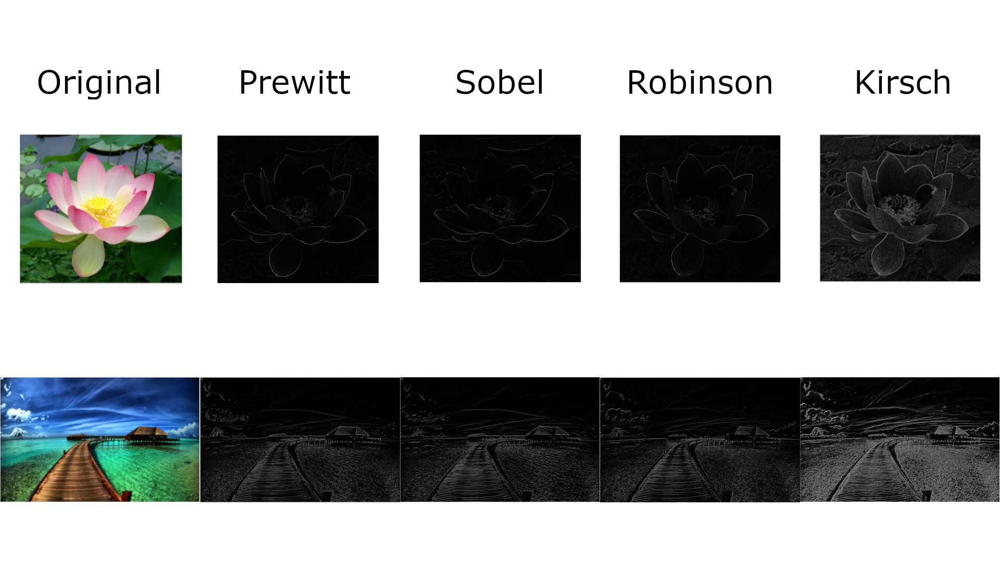
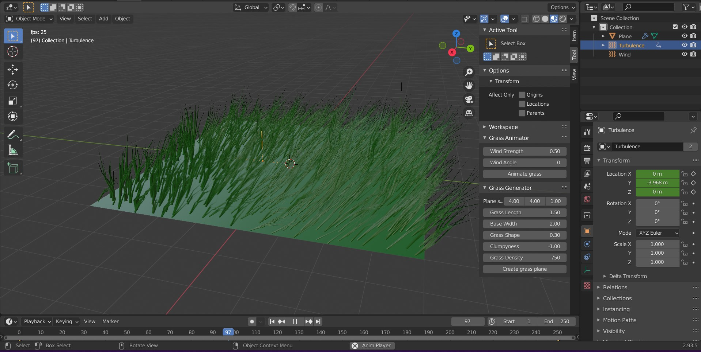

= Dokumentace

== 2D

Vytvoření pluginu, který provádí základní detekci hran.

link:2D/dokumentace1.adoc[Dokumentace 2D úlohy]

== 3D

Vytvoření pluginu, který vygeneruje a rozanimuje model trávy

link:3D/dokumentace2.adoc[Dokumentace 3D úlohy]
